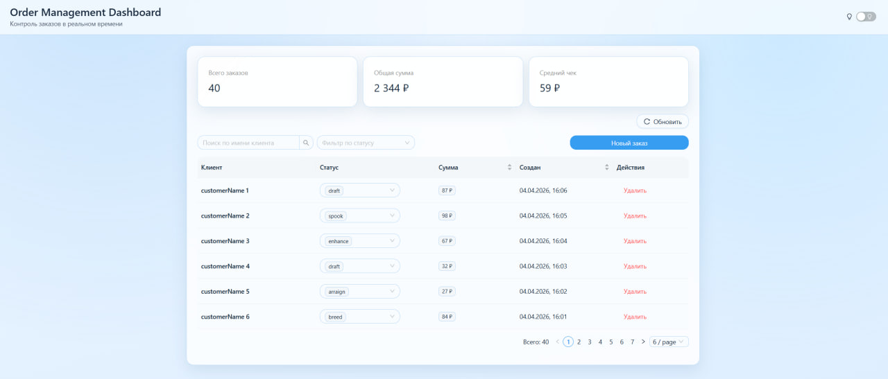
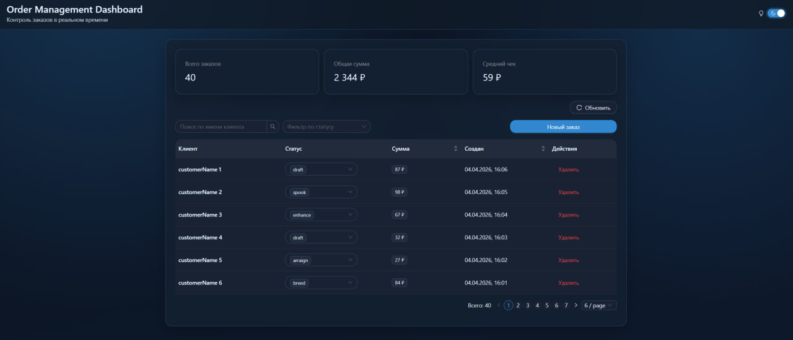

# Order Management Dashboard

Панель управления заказами на React + TypeScript + Vite.

## Технологии

- React 19
- TypeScript (strict)
- Ant Design v5
- Redux Toolkit + React Redux
- Axios
- Vitest

## API

- `https://69d0b59590cd06523d5d6996.mockapi.io/api/v1/orders`

## Запуск

```bash
npm install
npm run dev
```

Production build:

```bash
npm run build
```

Тесты:

```bash
npm run test
```

## Что реализовано

- Таблица заказов
- Пагинация на клиенте
- Сортировка по сумме и дате
- Поиск по имени клиента
- Фильтр по статусу
- Создание заказа через модалку с валидацией
- Изменение статуса прямо в таблице
- Удаление заказа 
- Обработка загрузки 
- Обработка ошибок API
- Адаптивность

## Как работает CRUD в текущем API-режиме

Текущий mock endpoint поддерживает только чтение, поэтому реализован гибридный подход:

- `GET /orders` используется для первичной загрузки данных.
- `Создать`, `Сменить статус`, `Удалить` выполняются локально через Redux actions.
- Изменения сразу отображаются в UI и хранятся в state до перезагрузки страницы.
- После перезагрузки состояние снова берется из API.

## Бонусы

- Темная/светлая тема
- `useAsync` хук для выполнения async-операций
- Мемоизация фильтрации
- Unit-тесты критической логики:

## Архитектура

Упрощенный FSD-подход:

- `src/app` - инициализация приложения, провайдеры, store
- `src/pages` - композиция страницы заказов
- `src/widgets` - крупные блоки интерфейса (таблица, статистика)
- `src/features` - сценарии пользователя (создание, фильтры)
- `src/entities` - сущность заказа (типы, API, slice, фильтрация)
- `src/shared` - общие хуки и утилиты

## Почему Redux Toolkit

`RTK` выбран как state manager, потому что для этой задачи он самый практичный.

Нужно хранить список заказов, состояние загрузки и ошибки в одном месте, и RTK делает это удобно и прозрачно.
Асинхронные запросы (`createAsyncThunk`) описываются без лишней рутины, а код остается читаемым.
Плюс RTK хорошо масштабируется: если в проекте появятся новые сущности, текущую структуру легко расширить.
И отдельно важно, что с TypeScript strict все типизируется комфортно и без лишних костылей.

## Скриншоты

### Главный экран (light)


### Главный экран (dark)
